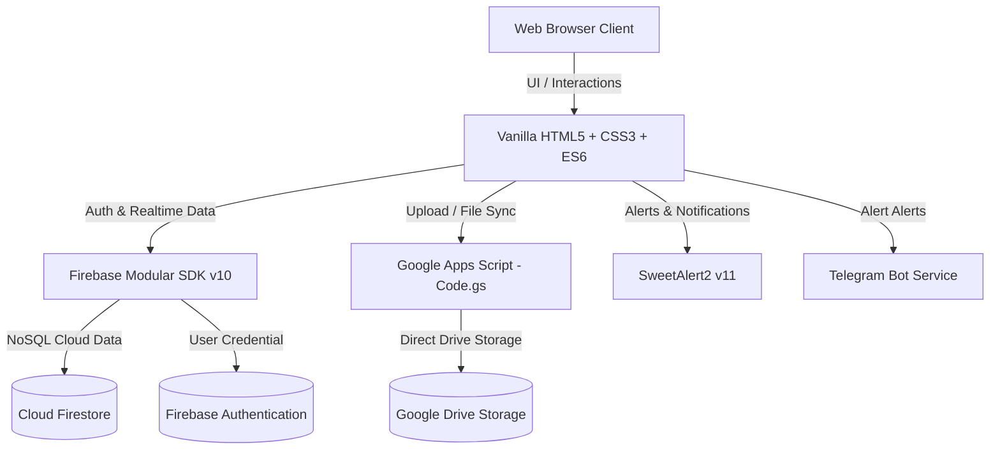

# 🏢 Mentra Manager — Enterprise ERP & Operations Platform

> **ระบบบริหารจัดการองค์กร ทรัพยากร งาน และเอกสารการขายแบบครบวงจร**  
> พัฒนาสำหรับ **บริษัท เมนทร้า โซลูชั่น จำกัด (Mentra Solution Co., Ltd.)**

---

## 📌 สารบัญ (Table of Contents)
1. [ภาพรวมของระบบ (Project Overview)](#-ภาพรวมของระบบ-project-overview)
2. [สถาปัตยกรรมและเทคโนโลยี (Architecture & Tech Stack)](#-สถาปัตยกรรมและเทคโนโลยี-architecture--tech-stack)
3. [โครงสร้างไฟล์และไดเรกทอรี (Directory Structure)](#-โครงสร้างไฟล์และไดเรกทอรี-directory-structure)
4. [รายละเอียดโมดูลและหน้าเว็บทั้งหมด (Modules & Pages Guide)](#-รายละเอียดโมดูลและหน้าเว็บทั้งหมด-modules--pages-guide)
   - [4.1 ระบบยืนยันตัวตน (Authentication)](#41-ระบบยืนยันตัวตน-authentication)
   - [4.2 โมดูลผู้ดูแลระบบ (Admin Module)](#42-โมดูลผู้ดูแลระบบ-admin-module)
   - [4.3 โมดูลจัดซื้อและคลังสินค้า (Purchasing & Inventory)](#43-โมดูลจัดซื้อและคลังสินค้า-purchasing--inventory)
   - [4.4 โมดูลบัญชีและเอกสารการขาย (Accounting & Sales Flow)](#44-โมดูลบัญชีและเอกสารการขาย-accounting--sales-flow)
   - [4.5 โมดูลตารางงานและการฝึกอบรม (Schedule & Operations)](#45-โมดูลตารางงานและการฝึกอบรม-schedule--operations)
5. [จุดเด่นด้านประสิทธิภาพและนวัตกรรม (Key Features & Optimizations)](#-จุดเด่นด้านประสิทธิภาพและนวัตกรรม-key-features--optimizations)
6. [การติดตั้งและตั้งค่าระบบ (Setup & Configuration Guide)](#-การติดตั้งและตั้งค่าระบบ-setup--configuration-guide)
7. [มาตรฐานการออกแบบและเขียนโค้ด (Design System & Guidelines)](#-มาตรฐานการออกแบบและเขียนโค้ด-design-system--guidelines)

---

## 🌟 ภาพรวมของระบบ (Project Overview)

**Mentra Manager** เป็นเว็บแอปพลิเคชันระดับองค์กร (Enterprise Web Application) ที่ออกแบบมาเพื่อตอบโจทย์การบริหารจัดการธุรกิจ งานจัดซื้อ เอกสารทางการเงิน และการบริหารจัดการงานภายในองค์กรอย่างคล่องตัว โดยยึดหลัก:
- **Zero Heavy Framework Runtime**: โหลดเร็ว ตอบสนองฉับไว ทำงานบน Pure HTML5, Modern Vanilla CSS3 และ Vanilla ES6+ JavaScript โดยไม่มีภาระโหลดจากเฟรมเวิร์กขนาดใหญ่
- **Realtime Cloud Database**: จัดเก็บและซิงก์ข้อมูลแบบเรียลไทม์ผ่าน **Google Firebase Cloud Firestore** พร้อมระบบออฟไลน์แคช
- **Unlimited Drive Storage**: จัดเก็บไฟล์ รูปภาพสินค้า และเอกสารแนบผ่าน **Google Drive API** โดยมี **Google Apps Script (GAS)** เป็นสะพานเชื่อมต่อที่มีความปลอดภัยสูง
- **Multi-Shop & Multi-Branch Support**: รองรับการบริหารจัดการหลายร้านค้า/หลายสาขา พร้อมเมนูสลับร้านและแบ่งแยกสิทธิ์ข้อมูล (Data Isolation)

---

## 🏗️ สถาปัตยกรรมและเทคโนโลยี (Architecture & Tech Stack)



### 1. Frontend Layer
- **Core**: HTML5, Vanilla JavaScript (ES6+ Modules)
- **Styling**: Modern CSS3, CSS Custom Properties (Variables), Flexbox & CSS Grid, Glassmorphism, Micro-animations
- **Design & Icons**: FontAwesome 6.4.0, Boxicons 2.1.4
- **Typography**: Google Fonts (`Kanit`, `Inter`, `Prompt`, `Sarabun`)
- **Interactive UI**: SweetAlert2 (Popup & Dialog แจ้งเตือนสไตล์ Mentra)

### 2. Backend & Cloud Infrastructure
- **Google Firebase (v10 Modular SDK)**:
  - **Firebase Authentication**: จัดการ Session ผู้ใช้, สิทธิ์การเข้าใช้งาน
  - **Cloud Firestore**: ฐานข้อมูล NoSQL แบบเรียลไทม์ พร้อมเปิดใช้งาน `persistentMultipleTabManager` ทำให้อ่านข้อมูลได้แม้ออฟไลน์
- **Google Apps Script (GAS - `Code.gs`)**:
  - สะพานเชื่อมต่อ Client สู่ Google Drive API โดยตรง
  - รองรับ Resumable Chunked Upload สำหรับไฟล์ขนาดใหญ่ ข้ามข้อจำกัด 50MB
  - จัดการโฟลเดอร์อัตโนมัติตามโครงการและรหัสสินค้า
- **Telegram Notification Service (`telegram-service.js`)**:
  - แจ้งเตือนสถานะงาน เอกสารจัดซื้อ และการเปลี่ยนแปลงที่สำคัญผ่าน Telegram Bot

---

## 📁 โครงสร้างไฟล์และไดเรกทอรี (Directory Structure)

```text
mentra-manager/
├── index.html                           # หน้าแรก / ล็อกอินและตรวจสอบสิทธิ์เข้าใช้งาน
├── Code.gs                              # Google Apps Script Web App Backend (Google Drive Gateway)
├── appsscript.json                      # การตั้งค่า Manifest สำหรับ Google Apps Script
├── run_server.bat                       # สคริปต์เปิด Local Server สำหรับทดสอบบน Windows
├── logo.png                             # โลโก้หลักของ Mentra Manager
├── pattern_prompt.md                    # แนวทางการพัฒนาและ Prompt สำหรับ AI Pair Programming
│
├── assets/                              # ทรัพยากรส่วนกลาง
│   ├── css/
│   │   ├── app-theme.css                # ตัวแปรสีหลัก (:root), สไตล์ UI กลาง และ Utility Classes
│   │   ├── dashboard-dual-sidebar.css   # สไตล์ Dual-Rail Sidebar เมนูนำทาง 2 ระดับ
│   │   ├── quotation-pro.css            # สไตล์เฉพาะสำหรับฟอร์มใบเสนอราคาแบบมืออาชีพ
│   │   └── training_styles.css          # สไตล์สำหรับระบบอบรมและกิจกรรม
│   ├── js/
│   │   ├── firebase-config.js           # การเชื่อมต่อ Firebase App, Auth, Firestore
│   │   ├── dashboard-dual-sidebar.js    # คอมโพเนนต์เมนูนำทางด้านข้าง (Dual-Rail Sidebar + Multi-Shop)
│   │   ├── app-ui.js                    # ฟังก์ชัน UI ส่วนกลางและ Helper ทั่วไป
│   │   ├── default-form-template.js     # โครงสร้างแบบฟอร์มมาตรฐาน
│   │   ├── gas_upload_script.js         # โมดูลอัปโหลดไฟล์ขนาดใหญ่แบบ Chunked สู่ Google Drive
│   │   └── telegram-service.js          # บริการส่งข้อความแจ้งเตือนผ่าน Telegram Bot
│   └── img/                             # ไอคอนและรูปภาพประกอบระบบ
│
├── pages/                               # รวมหน้าเว็บแยกตามโมดูลการทำงาน
│   ├── admin/                           # 👑 โมดูลผู้ดูแลระบบ & นักพัฒนา
│   │   ├── dashboard.html               # ภาพรวมระบบ สถิติยอดขาย กราฟ และ KPI องค์กร
│   │   ├── developer.html               # 🛠️ ศูนย์เครื่องมือผู้พัฒนา (Dev Console, Firestore CRUD, Drive Sandbox, Cache)
│   │   ├── console_admin.html           # จัดการผู้ใช้ สิทธิ์เข้าถึง (Role) และตั้งค่าระบบ
│   │   ├── company_settings.html        # ตั้งค่าข้อมูลบริษัท เลขผู้เสียภาษี ที่อยู่ บัญชีธนาคาร
│   │   └── business_card.html           # นามบัตรดิจิทัลของพนักงาน พร้อม QR Code
│   │
│   ├── purchasing/                      # 🛒 โมดูลจัดซื้อและคลังสินค้า
│   │   ├── products.html                # คลังสินค้า/บริการ หมวดหมู่ สเปก อัปโหลดรูปภาพ (High-Speed Cache)
│   │   ├── materials_purchasing.html    # ระบบจัดซื้อวัสดุ/สินค้า (PR / PO) พร้อมประวัติและสถานะ
│   │   └── materials_purchasing_company.html # สมุดรายชื่อบริษัทคู่ค้า / ซัพพลายเออร์
│   │
│   ├── accounting/                      # 💰 โมดูลบัญชีและงานขาย
│   │   ├── quotation.html               # สร้างใบเสนอราคา (Quotation), Invoice, Receipt, Tax Invoice
│   │   └── sales_documents.html         # คลังประวัติเอกสารการขาย ค้นหา ดูย้อนหลัง พิมพ์ PDF และลบเอกสาร
│   │
│   └── schedule/                        # 📅 โมดูลตารางงานและการฝึกอบรม
│       ├── tasks.html                   # กระดานบริหารจัดการงาน (Kanban & Table View, Drag & Drop)
│       ├── calendar.html                # ปฏิทินงาน นัดหมาย และกำหนดการส่งมอบ
│       ├── external_training.html       # ระบบบันทึกและติดตามการฝึกอบรมภายนอก
│       ├── register_training.html       # ฟอร์มลงทะเบียนเข้าร่วมอบรม
│       ├── certificate_template.html    # แม่แบบการออกใบประกาศนียบัตร
│       └── internship_journal.html      # บันทึกการฝึกงานและประเมินผลนักศึกษาฝึกงาน
│
├── _maintenance_scripts/                # สคริปต์ Python / Node.js สำหรับบำรุงรักษาและปรับปรุงระบบ
└── _deleted_pages_backup/               # แฟ้มสำรองหน้าเว็บเดิมที่ถูกยกเลิกการใช้งาน
```

---

## 📄 รายละเอียดโมดูลและหน้าเว็บทั้งหมด (Modules & Pages Guide)

### 4.1 ระบบยืนยันตัวตน (Authentication)
* **`index.html`**
  - ประตูทางเข้าหลักของระบบ (Authentication Gateway)
  - รองรับการเข้าสู่ระบบด้วย Email & Password ผ่าน Firebase Auth
  - ตรวจสอบสถานะการล็อกอินอัตโนมัติ (Persistent Auth State)
  - ตรวจสอบสิทธิ์การใช้งานและดึงข้อมูลโปรไฟล์ผู้ใช้ พร้อมร้านค้าที่สังกัด

---

### 4.2 โมดูลผู้ดูแลระบบ (Admin Module)
* **`pages/admin/dashboard.html`**
  - **ศูนย์รวมสถิติผู้บริหาร (Executive Dashboard)**
  - สรุปตัวเลขทางการเงิน: ยอดขายรวม ใบเสนอราคาที่รออนุมัติ ยอดค้างชำระ และรายรับสุทธิ
  - กราฟแนวโน้มยอดขายและผลการดำเนินงาน
  - ตัวกรองข้อมูลตามช่วงเวลาและสาขา/ร้านค้า
* **`pages/admin/developer.html`** 🛠️
  - **ศูนย์เครื่องมือผู้พัฒนาและจัดการข้อมูลระบบ (Developer Console & Data Manager)**
  - ตรวจสอบความพร้อมและวินิจฉัยระบบ (Firebase Ping, Firestore Latency, GAS Ping, Drive Root Folder Access)
  - **Firestore Data Explorer**: ค้นหา, ดูโครงสร้าง JSON, แก้ไขฟิลด์, ลบเอกสาร, สร้างเอกสารใหม่, ส่งออก/นำเข้า JSON รายคอลเลกชัน
  - **Google Drive Sandbox**: เครื่องมือทดสอบอัปโหลดไฟล์จริง, ทดสอบสร้างโฟลเดอร์บนไดรฟ์, ตรวจสอบไฟล์ใน Folder ID
  - **Config Overrides**: ปรับแต่งค่า `GAS_URL`, `DRIVE_ROOT_FOLDER_ID`, Security PIN, Telegram Token เฉพาะเครื่อง
  - **Cache Manager**: ดูขนาดและล้างแคชความเร็วสูง (`mentra_cached_products_v1`, `mentra_cached_tasks_v1`, LocalStorage)
  - **Mock Data Sandbox**: สร้างข้อมูลจำลองสำหรับทดสอบระบบ (สินค้า, งาน, โครงการ) ในคลิกเดียว
* **`pages/admin/console_admin.html`**
  - จัดการรายชื่อผู้ใช้งานในระบบ (User Management)
  - กำหนดระดับสิทธิ์ (Role-based Access Control: Super Admin, Admin, Manager, Staff)
  - กำหนดสิทธิ์การเข้าถึงข้อมูลของแต่ละสาขา/ร้านค้า
* **`pages/admin/company_settings.html`**
  - จัดการข้อมูลนิติบุคคลและข้อมูลบริษัท
  - ตั้งค่าชื่อบริษัททั้งภาษาไทยและอังกฤษ, เลขประจำตัวผู้เสียภาษี, สำนักงานใหญ่/สาขา
  - ข้อมูลบัญชีธนาคารสำหรับรับชำระเงิน, โลโก้บริษัท, ตราประทับ และลายเซ็นดิจิทัล
* **`pages/admin/business_card.html`**
  - นามบัตรดิจิทัลสำหรับพนักงานและผู้บริหาร
  - สร้าง QR Code สำหรับสแกนบันทึกรายชื่อติดต่อ (vCard) เข้าสู่สมาร์ตโฟนได้ทันที

---

### 4.3 โมดูลจัดซื้อและคลังสินค้า (Purchasing & Inventory)
* **`pages/purchasing/products.html`**
  - **แคตตาล็อกสินค้าและบริการ (Product Catalog & Inventory)**
  - เพิ่ม แก้ไข ค้นหา และจัดหมวดหมู่สินค้า
  - ระบบจัดเก็บรูปภาพสินค้าขึ้น Google Drive โดยตรง
  - **ระบบเร่งความเร็วขั้นสูง**:
    - ดึงข้อมูลจาก LocalStorage ทันที (0ms Instant Render) ก่อนอัปเดตเบื้องหลัง
    - Skeleton Loading Pulse Card ป้องกันหน้าจอวูบวาบ
    - ย่อภาพ Thumbnail `w400` พร้อม `loading="lazy"` และ `decoding="async"` ช่วยประหยัดแบนด์วิดท์
* **`pages/purchasing/materials_purchasing.html`**
  - ใบขอซื้อ/ใบสั่งซื้อวัสดุ (Purchase Requisition & Purchase Order)
  - รายการวัสดุสำหรับโครงการและงานช่าง
  - ติดตามสถานะการสั่งซื้อ วันที่นัดส่งของ และการอนุมัติงบประมาณ
* **`pages/purchasing/materials_purchasing_company.html`**
  - ทะเบียนบริษัทคู่ค้า ผู้จัดจำหน่าย และซัพพลายเออร์ (Vendor Management)
  - ข้อมูลติดต่อ เลขผู้เสียภาษี เงื่อนไขเครดิตเทอม และประวัติการจัดซื้อ

---

### 4.4 โมดูลบัญชีและเอกสารการขาย (Accounting & Sales Flow)
* **`pages/accounting/quotation.html`**
  - **ระบบสร้างเอกสารการขายอัจฉริยะ (Sales Document Engine)**
  - รองรับวงจรเอกสารการขายครบ 4 ขั้นตอน:
    1. **ใบเสนอราคา (Quotation)**
    2. **ใบแจ้งหนี้ (Invoice)**
    3. **ใบเสร็จรับเงิน (Receipt)**
    4. **ใบกำกับภาษี (Tax Invoice)**
  - คำนวณภาษีมูลค่าเพิ่ม (VAT 7%) และหักภาษี ณ ที่จ่าย (Withholding Tax 1%, 3%) โดยอัตโนมัติ
  - ระบบสร้างและพิมพ์เอกสาร PDF มาตรฐานธุรกิจ ออกแบบจัดหน้ากระดาษ A4 สวยงาม พร้อมตราประทับและลายเซ็น
  - **ความปลอดภัย**: ระบบป้องกันการล้างฟอร์มผิดพลาดด้วย **Security PIN Code (1234)**
  - มีปุ่มทางลัด "ประวัติ" (History) ลิงก์ตรงสู่หน้าคลังเอกสารทันที
* **`pages/accounting/sales_documents.html`**
  - **คลังรวบรวมประวัติเอกสารการขายทั้งหมด**
  - ค้นหาเอกสารตามเลขที่เอกสาร, ชื่อลูกค้า, วันที่ หรือสถานะการชำระเงิน
  - เรียกดูเอกสารย้อนหลัง สั่งพิมพ์ซ้ำ (Re-print) หรือดาวน์โหลด PDF
  - **ระบบลบเอกสารที่ปลอดภัย**:
    - แสดง SweetAlert2 ยืนยันความปลอดภัยพร้อมรายละเอียดเอกสาร
    - ลบข้อมูลครอบคลุมทั้งคอลเลกชันหลักและคอลเลกชันสำรองบน Firestore

---

### 4.5 โมดูลตารางงานและการฝึกอบรม (Schedule & Operations)
* **`pages/schedule/tasks.html`**
  - **กระดานบริหารจัดการงานและโครงการ (Task Management)**
  - สลับมุมมองได้ทั้งแบบ **Kanban Board** (ลากและวางการ์ดงาน) และ **Table View** (ตารางสรุปงาน)
  - ตัวกรองงาน: กรองตามผู้รับผิดชอบ, สถานะ (รอดำเนินการ, กำลังทำ, เสร็จสิ้น), หรือลำดับความสำคัญ
  - **ปรับปรุงความเร็วสูงสุด**: ตัด Tailwind runtime 3MB หันมาใช้ Pure CSS ปรับแต่งให้เปิดปุ๊บติดปั๊บ พร้อม Instant Cache
* **`pages/schedule/calendar.html`**
  - ปฏิทินแสดงกำหนดการส่งมอบงาน วันนัดหมายลูกค้า และกิจกรรมภายในบริษัท
* **`pages/schedule/external_training.html` & `register_training.html`**
  - บันทึกการส่งพนักงานเข้ารับการอบรมและพัฒนาทักษะภายนอกองค์กร
  - ติดตามงบประมาณการอบรม ชั่วโมงการเรียนรู้ และรายงานผลหลังอบรม
* **`pages/schedule/certificate_template.html`**
  - เทมเพลตสำหรับพิมพ์หรือสร้างใบประกาศนียบัตรรับรองการอบรม
* **`pages/schedule/internship_journal.html`**
  - สมุดบันทึกการปฏิบัติงานรายวันของนักศึกษาฝึกงาน พร้อมระบบประเมินผลโดยพี่เลี้ยง

---

## ⚡ จุดเด่นด้านประสิทธิภาพและนวัตกรรม (Key Features & Optimizations)

### 1. สถาปัตยกรรมแคชระดับสูง (Dual Caching Strategy)
เพื่อให้ผู้ใช้งานได้รับประสบการณ์การทำงานที่เร็วที่สุด ระบบใช้กลยุทธ์การแคช 2 ระดับ:
1. **LocalStorage Instant Render**: เมื่อเข้าหน้าเว็บ เช่น `products.html` หรือ `tasks.html` ระบบจะดึงข้อมูลที่บันทึกล่าสุดในเครื่องมาแสดงผลทันทีภายใน **0ms** (ผู้ใช้ไม่ต้องรอวงล้อหมุน)
2. **Firestore Background Sync**: พร้อมกันนั้น ระบบจะเชื่อมต่อ Cloud Firestore เพื่อดึงข้อมูลล่าสุดมาอัปเดตแบบเบื้องหลัง (Background Fetch) อย่างราบรื่น

### 2. Dual-Rail Responsive Sidebar & Multi-Shop Switcher
- เมนูนำทางด้านข้างแบบ 2 ชั้น (Primary Rail & Secondary Flyout) ช่วยประหยัดพื้นที่หน้าจอและจัดหมวดหมู่โมดูลได้อย่างเป็นระเบียบ (`assets/js/dashboard-dual-sidebar.js`)
- สลับร้านค้า/สาขาได้ทันทีผ่าน Popover ด้านบนของแถบเมนูข้าง ระบบจะส่ง `shopId` ไปยังทุกโมดูลเพื่อแยกข้อมูลอย่างปลอดภัย

### 3. ระบบอัปโหลดไฟล์ขนาดใหญ่แบบแบ่งส่วน (Chunked Upload to Google Drive)
- ผ่านไฟล์ `assets/js/gas_upload_script.js` และ `Code.gs`
- ช่วยให้สามารถอัปโหลดไฟล์รูปภาพหรือเอกสารขนาดใหญ่ขึ้นสู่ Google Drive ได้โดยตรง โดยไม่ติดขัดปัญหาขนาดไฟล์จำกัดของ HTTP POST ทั่วไป

### 4. Zero Heavy Runtime Overheads
- หลีกเลี่ยงการใช้ Tailwind Play CDN หรือ React bundle ขนาดใหญ่ที่ทำให้หน้าเว็บหน่วง
- ควบคุมโครงสร้างและสไตล์ด้วย Pure CSS Modules ที่มีขนาดเล็กเพียงไม่กี่กิโลไบต์ ทำให้เปิดหน้าเว็บได้อย่างรวดเร็วแม้บนอุปกรณ์สเปกทั่วไปหรืออินเทอร์เน็ตความเร็วจำกัด

---

## 🚀 การติดตั้งและตั้งค่าระบบ (Setup & Configuration Guide)

### 1. ข้อกำหนดเบื้องต้น (Prerequisites)
- บัญชี **Google Firebase** (สำหรับ Auth & Firestore)
- บัญชี **Google Workspace / Gmail** (สำหรับ Google Apps Script และ Google Drive)
- เว็บเซิร์ฟเวอร์แบบสถิต (Static Web Server) เช่น Live Server บน VS Code, Apache, Nginx หรือรัน `run_server.bat` ในเครื่อง

### 2. การตั้งค่า Firebase (`assets/js/firebase-config.js`)
สร้างโปรเจกต์บน [Firebase Console](https://console.firebase.google.com/) แล้วนำค่า Config มาใส่ใน `assets/js/firebase-config.js`:
```javascript
import { initializeApp } from "https://www.gstatic.com/firebasejs/10.12.0/firebase-app.js";
import { getAuth } from "https://www.gstatic.com/firebasejs/10.12.0/firebase-auth.js";
import { initializeFirestore, persistentLocalCache, persistentMultipleTabManager } from "https://www.gstatic.com/firebasejs/10.12.0/firebase-firestore.js";

const firebaseConfig = {
  apiKey: "YOUR_API_KEY",
  authDomain: "YOUR_PROJECT.firebaseapp.com",
  projectId: "YOUR_PROJECT_ID",
  storageBucket: "YOUR_PROJECT.appspot.com",
  messagingSenderId: "YOUR_MESSAGING_SENDER_ID",
  appId: "YOUR_APP_ID"
};

const app = initializeApp(firebaseConfig);
export const auth = getAuth(app);
export const db = initializeFirestore(app, {
  localCache: persistentLocalCache({
    tabManager: persistentMultipleTabManager()
  })
});
```

### 3. การติดตั้ง Google Apps Script Backend (`Code.gs`)
1. เข้าไปที่ [Google Apps Script](https://script.google.com/) แล้วสร้าง New Project
2. คัดลอกโค้ดจากไฟล์ [`Code.gs`](file:///d:/MT-Developer/mentra-manager/Code.gs) ไปวาง
3. กดเลือกฟังก์ชัน `testAuth` แล้วกด **Run** เพื่ออนุญาตสิทธิ์การเข้าถึง Google Drive
4. กด **Deploy** > **New deployment**
   - ประเภท: **Web app**
   - Execute as: **Me**
   - Who has access: **Anyone**
5. คัดลอก Web App URL ที่ได้ไปกำหนดในระบบอัปโหลดไฟล์ของแอปพลิเคชัน

### 4. การรันในเครื่องสำหรับพัฒนา (Local Development)
ดับเบิลคลิกที่ไฟล์ [`run_server.bat`](file:///d:/MT-Developer/mentra-manager/run_server.bat) หรือใช้คำสั่ง:
```bash
python -m http.server 8000
```
จากนั้นเปิดเบราว์เซอร์ไปที่ `http://localhost:8000`

---

## 🎨 มาตรฐานการออกแบบและเขียนโค้ด (Design System & Guidelines)

### 1. จานสีหลัก (Color Palette & CSS Variables)
ระบบกำหนดตัวแปรสีหลักไว้ใน [`assets/css/app-theme.css`](file:///d:/MT-Developer/mentra-manager/assets/css/app-theme.css):
```css
:root {
  --primary: #1A6FBF;          /* น้ำเงินหลัก Mentra */
  --primary-dark: #145999;     /* น้ำเงินเข้ม สำหรับ Hover/Active */
  --primary-glow: rgba(26, 111, 191, 0.15);

  --secondary: #E07B2F;        /* ส้มแอ็กเซนต์ Mentra */
  --secondary-dark: #c4681f;
  --secondary-glow: rgba(224, 123, 47, 0.15);

  --bg-app: #f0f4f9;           /* สีพื้นหลังหน้าเว็บ */
  --bg-card: #ffffff;          /* สีพื้นหลังการ์ด/กล่องข้อความ */
  
  --success: #10b981;          /* สีสถานะสำเร็จ / ชำระแล้ว */
  --warning: #f59e0b;          /* สีสถานะแจ้งเตือน / รอดำเนินการ */
  --danger: #ef4444;           /* สีสถานะยกเลิก / ลบรายการ */
  --info: #3b82f6;             /* สีสถานะข้อมูลทั่วไป */
}
```

### 2. ฟอนต์ตัวอักษร (Typography)
- ฟอนต์ภาษาไทยและอังกฤษหลัก: **`Kanit`**, **`Inter`**, **`Prompt`**
- ทุกหน้าเว็บและ SweetAlert2 Popup ต้องกำหนด `font-family` ให้สอดคล้องกันเพื่อป้องกันปัญหาฟอนต์เพี้ยน

### 3. การแจ้งเตือน (Notifications & Alerts)
- **ห้าม** ใช้ `alert()` หรือ `confirm()` มาตรฐานของเบราว์เซอร์
- ให้ใช้ **`Swal.fire` (SweetAlert2)** โดยคุมสไตล์ปุ่มด้วยคลาสที่สอดคล้องกับธีม Mentra:
```javascript
Swal.fire({
  title: 'ยืนยันการทำรายการ?',
  text: 'คุณต้องการลบข้อมูลนี้ใช่หรือไม่ ข้อมูลจะไม่สามารถกู้คืนได้',
  icon: 'warning',
  showCancelButton: true,
  confirmButtonColor: '#ef4444',
  cancelButtonColor: '#64748b',
  confirmButtonText: 'ยืนยันการลบ',
  cancelButtonText: 'ยกเลิก',
  customClass: {
    popup: 'mentra-swal-popup'
  }
});
```

---

## 👥 ผู้พัฒนาและลิขสิทธิ์ (Credits & License)

- **เจ้าของโครงการ**: บริษัท เมนทร้า โซลูชั่น จำกัด (Mentra Solution Co., Ltd.)
- **สิทธิ์การใช้งาน**: Proprietary Software — สงวนลิขสิทธิ์สำหรับใช้งานภายในองค์กร